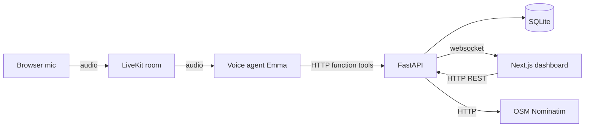
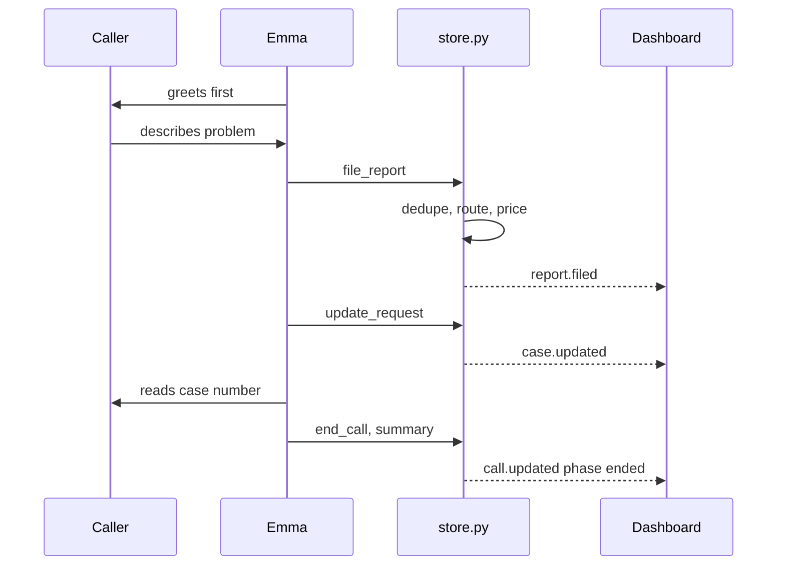
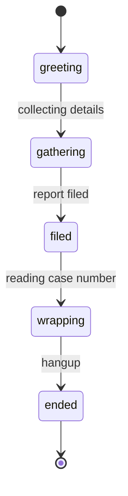
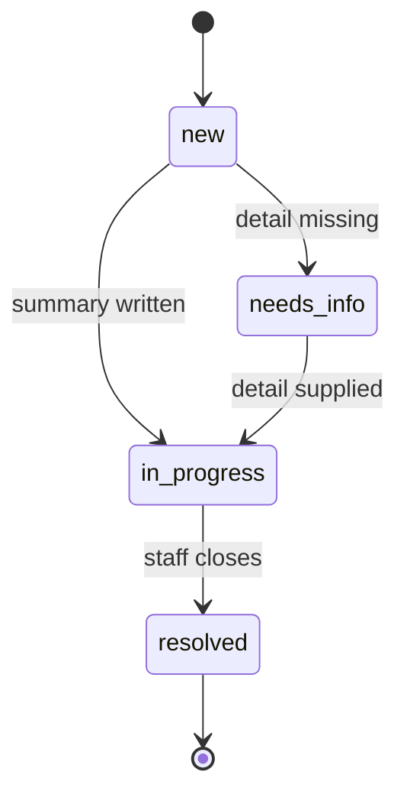

# Emma311: architecture

The system is three processes of our own over one database, and every fact the voice agent learns is written straight through to it.

- This document is the argument; [README.md](README.md) is the setup guide, [database.md](database.md) is the schema, and [TESTS.md](TESTS.md) is what was tested.
- The agent is **Emma**, the service is **Berkeley 311**, and the service area is **Berkeley, California**. She greets first and hangs up herself.

## 1. The modelling insight

Cities do not have a call problem, they have a pothole problem.

> A **Case** is the civic incident. A **Report** is one resident's observation of it.

| Consequence | Mechanism |
| --- | --- |
| Deduplication | A second caller attaches a `Report` to the open `Case`, not a new case |
| Corroboration raises priority | `report_count` feeds the score, moving a pothole from normal to high |
| Every caller keeps their callback | Name, phone, and description live on the `Report` |
| Staff see a call before it has a subject | `Call` is separate, and exists from the moment the room opens |
| One resolution date survives edits | The transition to `resolved` is an `Event`, not a column |
| Six calls, one incident | One `Case`, six `Report` rows, and six `Call` rows, because a `Call` produces at most one `Report` |

## 2. Three processes

The voice agent, the API, and the dashboard, plus the LiveKit dev server carrying audio; solid hops are the request path and the dashboard hop is the live stream.

- **The agent holds no state of its own,** and **the model reasons while the backend decides.** Every fact goes to the backend through a function tool as it is learned; the language model runs the conversation and extracts intent, and never decides routing, deduplication, or urgency.
- **One database is the source of truth,** so the dashboard reads the same rows the agent wrote and the two cannot disagree.

## 3. Where policy lives

`server/triage.py` holds pure functions with no database, no network, and no model call, so a city can read and change them without touching a prompt.

| Rule | Policy |
| --- | --- |
| Routing | Issue type maps to a department. A corrected type re-routes and logs `case.routed` |
| Deduplication | Merge when the issue type matches, the case is open, it is under 30 days old, and location Jaccard overlap is >= 0.5 |
| Priority | `severity x 10 + 15 per corroborating report + 1 per day of age (capped at 10) + 50 if escalated`, banded high at 35 and normal at 15 |
| Confidence gate | An `issue_type` is applied only at confidence >= 0.6, otherwise the case keeps `issue_type: null` and routes to `unassigned` |

- Location comparison strips street suffixes and filler, so "Shattuck and University" scores 1.0 against "University Ave and Shattuck". The dedupe threshold is conservative on purpose: a false merge hides a resident's report, which is worse than a duplicate case.
- A confidence of `None` means nobody measured it, so a staffer's typed category is taken at face value and only a stated low number is refused.

## 4. The single write choke point

Every mutation goes through `server/store.py`, which updates the row, appends an `Event`, and publishes a frame as one unit.

- No handler mutates a model directly, which is why the audit trail is complete and the dashboard never polls.
- Audit frames are published before the domain frame, so a client applying frames in order sees the reasons before the result.
- `case.updated`, `call.updated`, and `report.updated` each carry a non-empty `changed` list, and when nothing moved no frame is published at all, which is what makes "file early, patch often" cheap: a repeated identical PATCH is silent rather than a flicker on the board.

## 5. One call, end to end

Emma files as soon as she knows what and where, then patches as she learns.

- `file_report` returns whether the report opened a case or merged into one, and Emma must tell the caller which. Every arrow into `store.py` also writes an `Event`, which streams as `event.appended`.
- `end_call` is Emma's own tool: it drains the session so the closing line finishes playing, then deletes the room, which triggers the summary and `status = completed`.

## 6. The live event protocol

The failure this design prevents: a dashboard that has quietly lost its connection while still showing confident data.

- Every frame is exactly `{"v": 1, "seq": 128, "ts": "...", "type": "case.updated", "payload": {...}}`, with `seq` strictly increasing and gap-free. Control frames (`hello`, `pong`, `resync_required`) carry `seq: null`.
- **Durable outbox.** Each data frame is written as an `Outbox` row and committed *before* broadcast, and `seq` is that row's primary key, so ordering survives an API restart. It stores the serialized frame and keeps the most recent 2000 rows, so a replay is history rather than a fresh snapshot of current rows.
- **Resume.** The client connects to `/ws?since=<seq>`; the first frame is always `hello`.

| `hello` says | Client does |
| --- | --- |
| `resume: true`, `from`/`to` | Missed frames arrive in ascending `seq` order, then live traffic |
| `resume: false` | Discard local state, refetch snapshots over REST |

- `resume: false` is returned when `since` is absent, negative, ahead of the server, or older than the retained window. The client ignores any frame whose `seq` is not greater than the last it applied, so a replayed frame is idempotent.
- **Backpressure.** Each client has a bounded 256-frame queue drained by its own writer task. On overflow the server drops that client's backlog, sends `resync_required`, and keeps the socket open.
- **A socket must not hold a database connection.** The engine's pool is 5 connections plus 10 overflow, shared with every REST request. A handler that kept its request-scoped session for the life of the browser tab would let the 15th open dashboard take the last connection and stall the whole API, not just the websockets, so `server/main.py` reads the replay frames out of the rows and closes the session before the socket goes live.

| `type` | `payload` |
| --- | --- |
| `case.created` | the `Case` |
| `case.updated` | `{case, changed}` - never empty |
| `case.escalated` | the `Case` |
| `report.filed` | `{report, case, merged, similarity}` |
| `report.updated` | `{report, case_id, changed}` |
| `call.started` | the `Call` |
| `call.updated` | `{call, changed}` - a phase change is always its own frame |
| `transcript.turn` | the `Turn`, a final utterance |
| `transcript.delta` | `{call_id, turn_seq, role, text, final: false}` - replace, never concatenate |
| `event.appended` | the `Event` audit row |

- A delta carries the full text so far and the `turn_seq` the final turn will use, because a revised guess can be shorter than the one before it.

## 7. Call and case lifecycle

Call phase, driven by Emma, is what staff watch; `Call.status` is the coarse lifecycle behind it.

Case status, common path. Staff can set any status, and reopening is allowed.

- `Call.status` is only `active` or `completed`, and completing always forces `phase = ended` in the backend, so a crash cannot leave a call looking live. *When* a case reached `resolved` lives only in the audit log; `updated_at` moves for any edit and cannot date a fix.

## 8. Location resolution

The caller's words are kept, and the coordinates are best effort.

- Geocoding is **OpenStreetMap Nominatim**, bounded to Berkeley with `countrycodes=us` and a `viewbox` with `bounded=1`. A bare street or intersection gets `, Berkeley, CA` appended first.
- It runs **off the request path** as a background task, so a tool call never blocks on the network. Lookups are held to one a second and cached in process by normalized query text.
- The result is written through `store.py` like any other change, arriving as `case.updated` with the location fields in `changed`.
- `location_precision` is the honest part, and comes from what Nominatim says it matched: `exact` for a house number or intersection, `approximate` for something vaguer that still resolves, `unresolved` when nothing did. Failure is never visible to the caller - keep the text, mark it `unresolved`, log it, move on - and `EFFIGOV_GEOCODE=0` disables the network call entirely.

## 9. What staff see

Three surfaces, all driven by one websocket client (`web/src/lib/useLiveEvents.ts`).

| Surface | Panels |
| --- | --- |
| Dashboard | Four stat tiles with sparklines, recent cases, call volume, cases by type, needs attention |
| Call console | Three columns of fixed height: the case activity timeline, one merged call panel (caller, the agent's read, the line, the controls), then the live transcript and extracted information |
| Case detail | Overview, Transcript, Details, Activity, Notes. Overview carries a derived progress stepper, the case summary, AI collected details, the resident, and the incident location |

- The incident location map is an OpenStreetMap iframe with a bounding box and a marker - no key, no account, no map library - and has three honest states: a pin, still locating, no match.
- Rows change contents live but change *order* only when nobody is reading: a reorder is withheld while the pointer or focus is in the table, and surfaced as a pill. A field with a staff PATCH in flight is locally owned until it resolves, so the websocket echo of the pre-edit value cannot undo the edit.

## 10. The analytics API

`server/analytics.py` is read-only, derives every number from rows that already exist, and caches or precomputes nothing.

| Endpoint | Returns |
| --- | --- |
| `GET /api/stats/summary` | The four tiles - open cases, live calls, average resolution days, escalations - each as `{value, change, series}` with a dense 7-day sparkline, plus `resolved_sample` |
| `GET /api/stats/call-volume?days=7` | Calls per day over the window (1-90), the previous window's total, and the percent change |
| `GET /api/stats/cases-by-type` | Case mix as slices, top 5 named and the tail folded into `Other` alongside the unclassified |
| `GET /api/stats/needs-attention` | Three actionable queues: high priority with no department, escalated and still open, missing a location |

- **A resolution is dated from the audit log,** from the *first* `case.updated` / `status` / `resolved` event. A case with no such event is excluded from the average rather than guessed at.
- **Series are dense.** A day with no activity is a zero bucket, because a sparkline drawn from sparse data closes the gaps and makes a quiet week look busy.
- The dashboard reads all four endpoints independently, so one failing blanks one panel rather than the page.

## 11. Honest limitations

- **Interim transcription is one-sided.** The installed `livekit-agents` exposes interim transcription for the caller and none for the agent's own speech, so the caller's words stream mid-utterance while Emma's arrive one utterance at a time, as a single delta immediately before the final turn.
- **Deduplication is lexical.** Geocoding informs the map, not the merge, so "the big hole by the Safeway" still misses; merging on a radius is the obvious upgrade.
- **Three call fields are defaults, not observations.** `caller_city`, `line_type`, and `language` are column defaults nothing ever writes, and the console renders them as if they were detected.
- **The analytics scan the tables.** Every `/api/stats` read loads the cases, calls, or events it needs; correct at 311 volumes, and the response shapes are what a materialized version would have to keep.
- **One process, one file, no broker.** Fan-out is in-process, so under multiple workers the notify path has to change, and `init_db` runs an additive `ALTER TABLE ADD COLUMN` pass that keeps a local SQLite database working without being able to rename or drop anything.
- **No auth on the API or the dashboard.** Transcripts and callback numbers are PII stored in the clear.
- **Escalation is a state change, not a dispatch,** and a retried tool call files a second report because there are no idempotency keys.

## 12. Testing

What is covered, what was verified by hand, and what was not tested at all is in [TESTS.md](TESTS.md).

- The policy in section 3, the write path in section 4, the protocol in section 6, and the analytics in section 10 each have a suite. The model's conversation and the browser UI do not, there are no frontend tests, and nothing runs on push.
