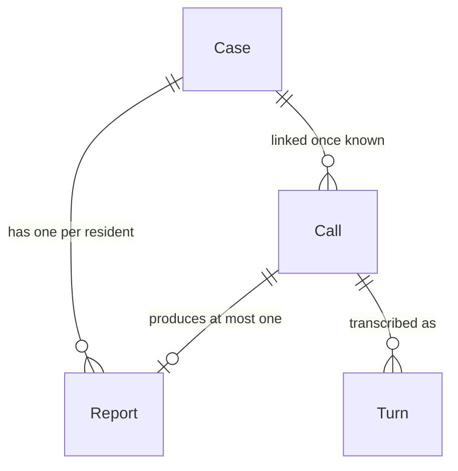
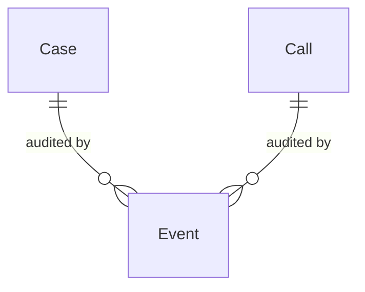
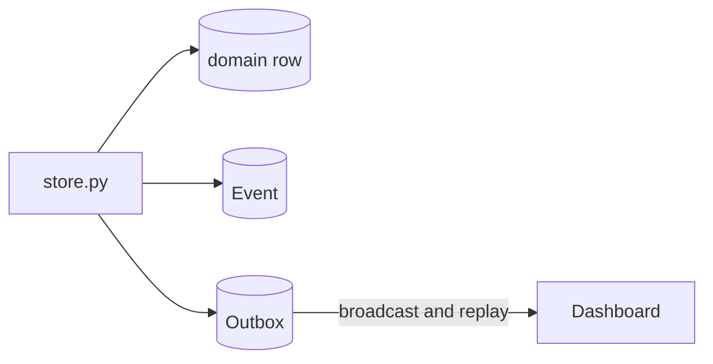

# EffiGov 311: database

One SQLite file, six tables, defined in `server/models.py` and created by `server/db.py`.

- `DATABASE_URL` defaults to `sqlite:///./effigov.db`. The file is gitignored but is also the demo's memory.
- `init_db` runs an additive `ALTER TABLE ADD COLUMN` migration before `create_all`, then backfills. Nothing is dropped or rewritten.
- Timestamps are written UTC-aware. SQLite hands them back naive, so read paths re-attach UTC before comparing.

## Entity diagram

The domain tables and their real cardinalities.

The audit log points at both, and either side may be null.

`Outbox` has no relationships. It is not domain data, it is the ordering truth for the live stream.

## Who sets what

Three writers, and every column below is tagged with one of them.

| Writer | Means |
| --- | --- |
| **agent** | The voice agent Emma, through a function tool, via the REST API |
| **staff** | A human in the dashboard, through a PATCH or a note |
| **system** | The backend itself: defaults, triage, lifecycle, geocoding |

## Enums

| Enum | Values | Column |
| --- | --- | --- |
| `CaseStatus` | `new`, `in_progress`, `needs_info`, `resolved` | `case.status` |
| `IssueType` | `missed_collection`, `pothole`, `streetlight`, `noise_complaint`, `water_leak`, `graffiti`, `other` | `case.issue_type` |
| `Department` | `public_works`, `sanitation`, `utilities`, `code_enforcement`, `parks`, `unassigned` | `case.department` |
| `Priority` | `low`, `normal`, `high` | `case.priority` |
| `CallStatus` | `active`, `completed` | `call.status` |
| `CallPhase` | `greeting`, `gathering`, `filed`, `wrapping`, `ended` | `call.phase` |
| `Sentiment` | `positive`, `neutral`, `negative` | `call.sentiment` |
| precision | `exact`, `approximate`, `unresolved` | `case.location_precision`, a plain string |

- Enums are stored as their string values, so the database file stays readable.
- `Department.parks` is reachable only by reassignment: no issue type routes to it.

## `case`

One civic incident, no matter how many people report it.

| Column | Type | Set by | Meaning |
| --- | --- | --- | --- |
| `id` | int, PK | system | Surrogate key |
| `case_number` | str, unique | system | `SR-######`. Digits only, so the agent can read it aloud |
| `issue_type` | enum, null | agent, staff | Category. Null while unclassified |
| `issue_type_confidence` | float, null | agent | 0.0-1.0. Stored even when too low to apply |
| `department` | enum | system | Derived from `issue_type` by `triage.route`. Never typed by the agent |
| `location` | str, null | agent, staff | The working location string, and what deduplication compares |
| `location_text` | str, null | agent | The caller's own words, unchanged |
| `location_formatted` | str, null | system | Normalized address returned by Nominatim |
| `latitude` | float, null | system | Geocoded, Berkeley-bounded |
| `longitude` | float, null | system | Geocoded, Berkeley-bounded |
| `location_precision` | str, null | system | `exact`, `approximate`, or `unresolved` |
| `location_detail` | str, null | agent | On-site note, such as "Right lane near crosswalk, curb side." |
| `description` | str, null | agent, staff | The canonical description of the incident |
| `status` | enum | agent, staff | Defaults `new`. The agent sets `in_progress` when it closes out |
| `priority` | enum | system | Band derived from `priority_score` |
| `priority_score` | int | system | `triage.priority_score`. The queue's sort key |
| `report_count` | int | system | Incremented for every report filed against this case |
| `escalated` | bool | agent | Set by `escalate_to_human`. Adds 50 to the score |
| `escalation_reason` | str, null | agent | One line on why a person is needed now |
| `notes` | str, null | staff, agent | Timestamped lines appended, never overwritten |
| `summary` | str, null | system | Written once at hangup by a small model |
| `created_at` | datetime | system | Filing time. Feeds the age term in the priority score |
| `updated_at` | datetime | system | Moves on any edit, so it cannot date a resolution |

- **The confidence gate lives here.** Below 0.6 the backend drops the proposed `issue_type` and keeps the confidence, so "cannot categorise yet" stays distinguishable from "nobody has looked".
- **Geocoding is best effort and off the request path.** A failure leaves the text intact and `location_precision` at `unresolved`; case creation never depends on the network.
- **`updated_at` cannot date a fix.** *When* a case reached `resolved` exists only as an `Event` row.

## `report`

One resident's account of an incident, and how to reach them.

| Column | Type | Set by | Meaning |
| --- | --- | --- | --- |
| `id` | int, PK | system | Surrogate key |
| `case_id` | int, FK `case.id` | system | The incident this observation is about |
| `call_id` | int, FK `call.id`, null | system | The voice session it came from, if any |
| `reporter_name` | str, null | agent | The caller's name as they said it |
| `reporter_phone` | str, null | agent | Callback number, digits only |
| `description` | str, null | agent | This resident's own words |
| `created_at` | datetime | system | Filing time |

- Reports are never merged into each other. A duplicate attaches to the existing case and both residents keep their own row.
- `reporter_phone` is stored as digits because lookup matches on digits. `+1 (510) 555-1212` is produced at serialization time.

## `call`

One voice session. Exists from the moment the LiveKit room opens.

| Column | Type | Set by | Meaning |
| --- | --- | --- | --- |
| `id` | int, PK | system | Surrogate key |
| `room` | str | system | LiveKit room name |
| `case_id` | int, FK `case.id`, null | agent | Attached once a report is filed or a case is looked up |
| `report_id` | int, null | agent | The report this call produced. Not a declared foreign key |
| `status` | enum | system | `active` until hangup, then `completed` |
| `phase` | enum | agent | `greeting`, `gathering`, `filed`, `wrapping`, `ended` |
| `caller_phone` | str, null | agent | Digits |
| `summary` | str, null | system | The same summary written to the case at hangup |
| `caller_name` | str, null | agent | On the call itself, so a console can name the caller before a report exists |
| `caller_city` | str, null | system | Defaults `Berkeley, CA` |
| `line_type` | str, null | system | Defaults `Mobile` |
| `language` | str, null | system | Defaults `English` |
| `sentiment` | enum | agent | How the caller sounds right now. Defaults `neutral` |
| `activity_line` | str, null | agent | One present-tense sentence, under about 60 characters |
| `started_at` | datetime | system | Room open |
| `ended_at` | datetime, null | system | Set together with `status = completed` |

- `status` answers "is this call still up?"; `phase` answers "what is the agent doing right now?", which is the question a supervisor has.
- Setting `status = completed` always forces `phase = ended` in the backend, so a crash between the two cannot leave a call looking live.
- `caller_phone_display` appears on the wire but is not a column: it is formatted during serialization.

## `turn`

One **final** line of transcript. Interim speech is never stored.

| Column | Type | Set by | Meaning |
| --- | --- | --- | --- |
| `id` | int, PK | system | Surrogate key |
| `call_id` | int, FK `call.id` | system | The call this line belongs to |
| `turn_seq` | int | system | Per-call ordering from 1. Unique together with `call_id` |
| `role` | str | system | `caller` or `agent` |
| `text` | str | system | The full utterance |
| `created_at` | datetime | system | Write time |

- `turn_seq` exists because wall-clock timestamps tie under load and give the dashboard no stable key for replacing a provisional line.
- A `transcript.delta` frame is broadcast under the `turn_seq` the eventual final turn will use, and carries the whole utterance so far. The client replaces, it never concatenates.

## `event`

Append-only audit trail. One row per field change or lifecycle moment.

| Column | Type | Set by | Meaning |
| --- | --- | --- | --- |
| `id` | int, PK | system | Surrogate key |
| `case_id` | int, FK `case.id`, null | system | The case this concerns |
| `call_id` | int, FK `call.id`, null | system | The call this concerns |
| `kind` | str | system | See the table below |
| `field` | str, null | system | Which column moved |
| `old_value` | str, null | system | Stringified previous value |
| `new_value` | str, null | system | Stringified new value |
| `actor` | str | system | `voice_agent`, `staff`, or `system` |
| `created_at` | datetime | system | When it happened |

| `kind` | Written when |
| --- | --- |
| `case.created` | A new case is opened |
| `case.updated` | A mutable case field moves. One row per field |
| `case.routed` | Triage assigns or reassigns the department |
| `case.escalated` | The agent flags an immediate danger |
| `priority.changed` | The score crosses a band boundary |
| `note.added` | A timestamped note is appended |
| `report.filed` | A report opens a new case |
| `report.merged` | A report attaches to an existing case |
| `call.started` | A LiveKit room opens |
| `call.phase` | The call moves to a new phase |
| `call.updated` | An audited call field moves: caller identity, sentiment, activity line |
| `call.ended` | The call hangs up |

- **This table is the only record of when something happened.** `server/analytics.py` dates a resolution from `kind="case.updated"`, `field="status"`, `new_value="resolved"`, taking the *first* such event per case.
- Anything writing a resolution outside `store.update_case` - `scripts/seed.py` does - has to write that event too, or the case drops out of the resolution-time average.

## `outbox`

Every data frame the server has broadcast, in the order it broadcast them.

| Column | Type | Set by | Meaning |
| --- | --- | --- | --- |
| `seq` | int, PK | system | The frame's sequence number, assigned by the database |
| `type` | str | system | The frame type, such as `case.updated` |
| `ts` | datetime | system | Write time, carried in the frame |
| `frame` | str | system | The exact JSON text that was sent |

- The row is written and committed **before** the frame goes out, so ordering survives an API restart.
- `frame` holds the sent JSON rather than a pointer to the current row: a replay is history, and a client resuming at seq 97 wants what happened at 97.
- Trimmed to the most recent 2000 rows on write. Past that a reconnecting client gets `resume: false` and refetches over REST.

## Indexes

| Table | Indexed | Why |
| --- | --- | --- |
| `case` | `case_number` (unique), `issue_type`, `department`, `status`, `priority_score` | Lookup by number, plus the dashboard's filters and sort |
| `report` | `case_id`, `call_id`, `reporter_phone` | Reports for a case, and lookup by a caller's number |
| `call` | `room`, `case_id`, `report_id`, `status`, `phase`, `sentiment` | The active-calls query and the live console |
| `turn` | `call_id`, `turn_seq`, unique `(call_id, turn_seq)` | Ordered transcript, and one row per sequence number |
| `event` | `case_id`, `call_id` | The audit timeline for one case or call |
| `outbox` | `seq` (PK), `type` | Replay is a range scan on `seq` |

## Which code path writes each table

| Table | Written by |
| --- | --- |
| `case` | `store.create_case`, `store.update_case`, `store.escalate`, `store.append_note`, `store.file_report`, the geocode callback |
| `report` | `store.file_report`, `store.update_report` |
| `call` | `store.start_call`, `store.update_call`, `store.set_phase` |
| `turn` | `store.add_turn` only. `store.add_interim` writes nothing |
| `event` | `store._log`, called from every function above |
| `outbox` | `store._emit` on the publish path, trimmed by `store._trim_outbox` |

- No request handler mutates a model directly. That is the invariant `server/store.py` exists to hold.
- `scripts/seed.py` is the deliberate exception: it backdates a fortnight of history straight to the database, because the REST API has no way to file a report last Tuesday and should not have one.

## Migrations

`server/db.py` lists every column added after the first release in `_ADDED_COLUMNS` and adds the missing ones in place.

- Additive only. SQLite can only `ADD COLUMN`, so each entry is nullable or carries a literal default.
- Backfills give old rows a value that is true of them: a call that already hung up gets `phase = ended`, and old turns recover `turn_seq` from their insertion order.
- A new column has to be added to both `server/models.py` and `_ADDED_COLUMNS`, or an existing local database will never get it.
